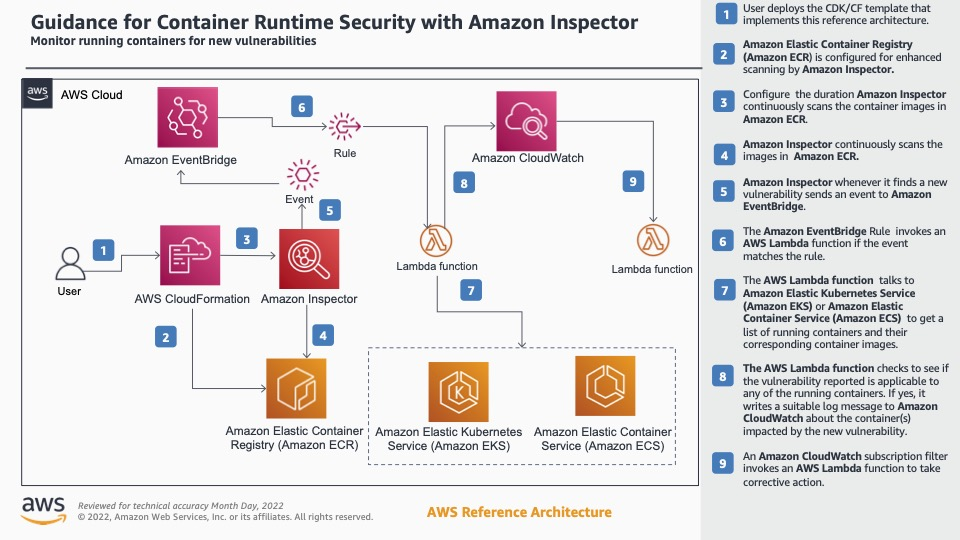

# Container Runtime Security - Sample Code
> This sample solution illustrates how to configure continuous scanning of container images in AWS, leveraging AWS native resources. Continuous scanning will enable a company to actively keep track of container images used in their environment and identify if and when an image has a common vulnerability. This solution can then be expanded by a company for rapid correction. 

## Reference Architecture

## Getting Started
This guidance assumes that one has an existing AWS account that is already being used. This account should already have container images stored in their Amazon Elastic Container Registry (Amazon ECR) and have running containers or pods in Amazon Elastic Container Service (Amazon ECS) or Amazon Elastic Kubernetes Service (EKS) respectively. This solution will not deploy ECR, ECS or EKS instances into an account.

### Deploying into Account:
Please follow the following deployment steps:
1. Install project packages by running `yarn`
2. Confirm AWS CLI is installed properly by running `aws --version`. If AWS CLI is not installed, please refer to this [documentation](https://docs.aws.amazon.com/cli/latest/userguide/getting-started-install.html).
3. Set AWS account details. Refer to the following [documentation](https://docs.aws.amazon.com/cli/latest/userguide/cli-chap-configure.html).
4. From the root of the project, synthesize the CloudFormation template - `cdk synth`.
5. One time bootstrap the AWS account - `cdk bootstrap`.
6. Deploy into account - `cdk deploy`.

### Verify Functionality:
Amazon ECR Enhanced Scanning integrates Amazon Inspector to provide container image vulnerability scanning. When a _new_ vulnerability is found in a running image, an event is created which is used to create a CloudWatch Log from the Lambda function, `CheckECS-Lambda`. Follow the log group found on the console for the lambda function to in the console for these logs. The function will print and identify if the vulnerability is present in an existing running container. One could simply wait until a vulnerability is found and trace it back, or, they can trigger the functionality themselves.

This solution is configured to scan existing container images as well as new images as they are pushed into Amazon ECR. Pushing a container image with a known vulnerability, such as one with an outdated programming language, will trigger the scanning. The solution will identify the vulnerability and generate a log.

## Clean Up:
This sample code is deployed using a CloudFormation template, meaning that the clean up is pretty straight forward. From the root folder of the CDK project, once can execute `cdk destroy` to delete the CloudFormation stack. This will remove all assets created when deployed into the account.

## License
This project is licensed under the MIT-0 License. See the [LICENSE](./LICENSE) file.